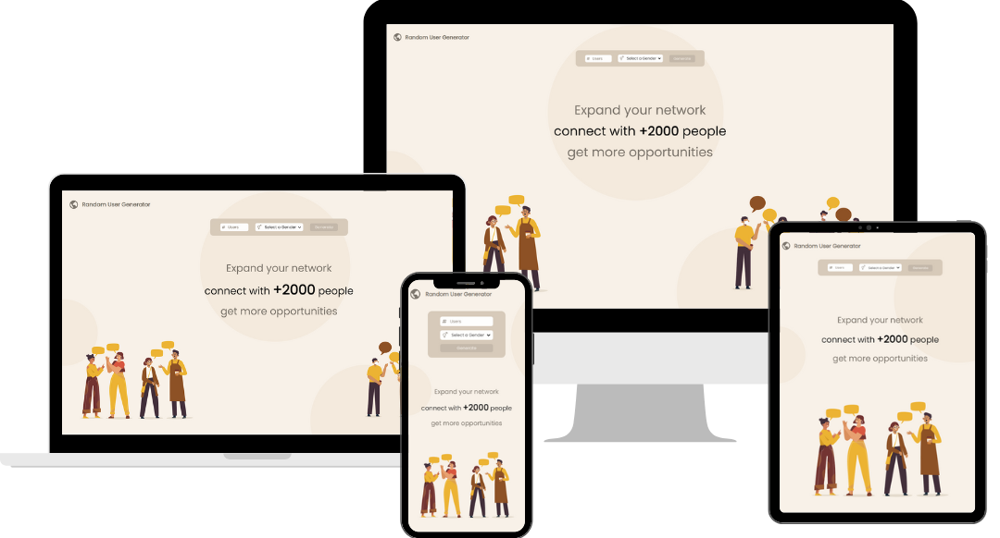
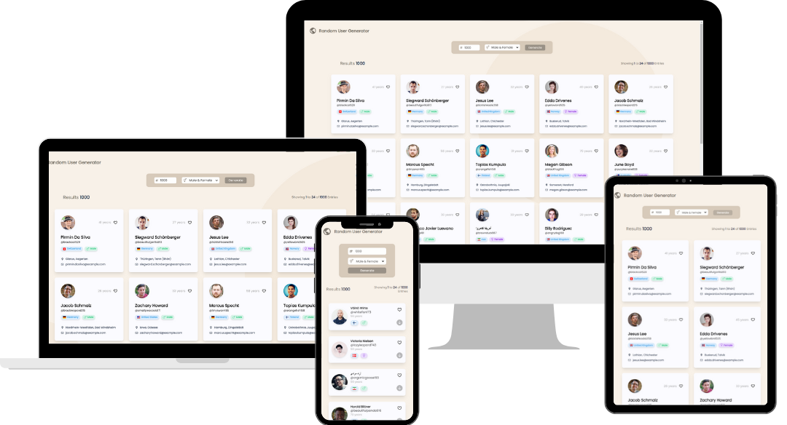

# Random User Generator

This website offers a simple and user-friendly interface where users can specify the number of random user profiles they want to generate. This tool generates random user profiles with information such as names, usernames, addresses, email addresses, ages, usernames and profile pictures.

This is a [Next.js](https://nextjs.org/) project bootstrapped with [`create-next-app`](https://github.com/vercel/next.js/tree/canary/packages/create-next-app).

## Run Locally

First, run the development server:

```bash
npm run dev
# or
yarn dev
# or
pnpm dev
```

Open [http://localhost:3000](http://localhost:3000) with your browser to see the result.

## Built With

|           |          |
| :-------- | :------- |
| | [Next.js](https://nextjs.org/)  - A React Web Framework |
| | [Tailwind](https://gettailwind.com/) - CSS Framework |
| | [Vercel](https://vercel.com/) - Cloud Application Platform |
|           |          |

## Features

- Enter the number and gender fields
- List users by pressing the generate button
- A button to go back to the top when you have scrolled down
- Pagination when there are more than 24 entries

## Docs
- tailwind - For the styles.
- tailwindcss-animated - For custom animations with ease.
- axios - For the requests
- react-toastify - Simple javascript toast notifications
- react-icons - A set of free SVG icons for UI development.

## Demo

### Responsive Design

Developed with a responsive design that adapts to different devices (mobiles, tablets, laptops, and desktops).

 
 
 
